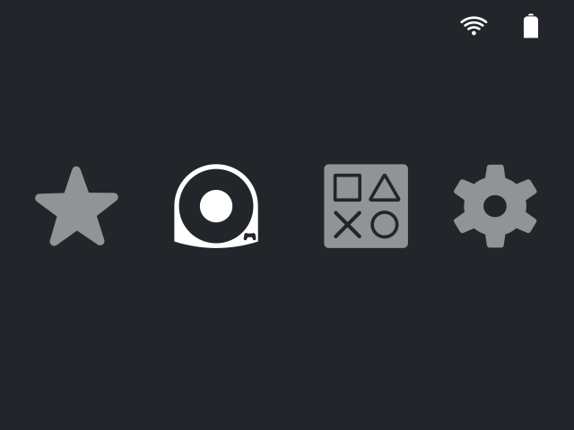
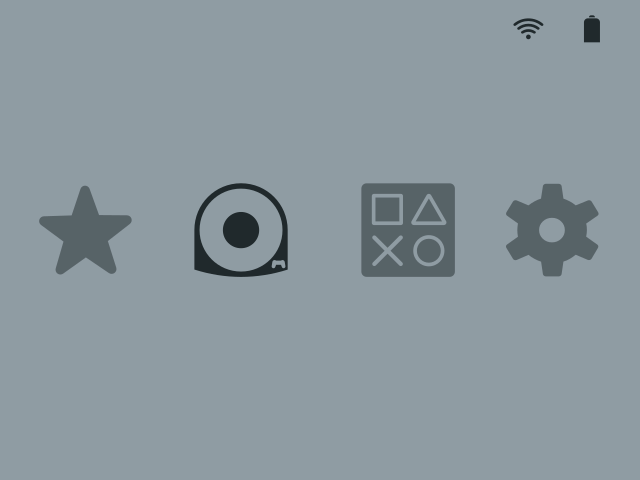
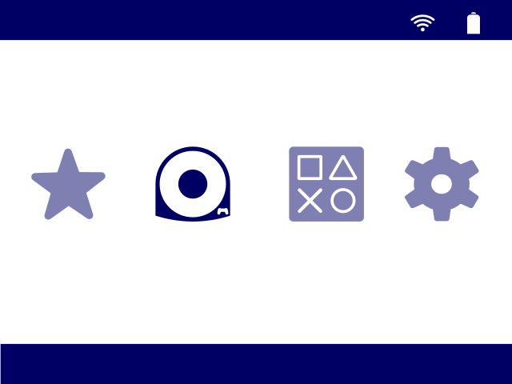
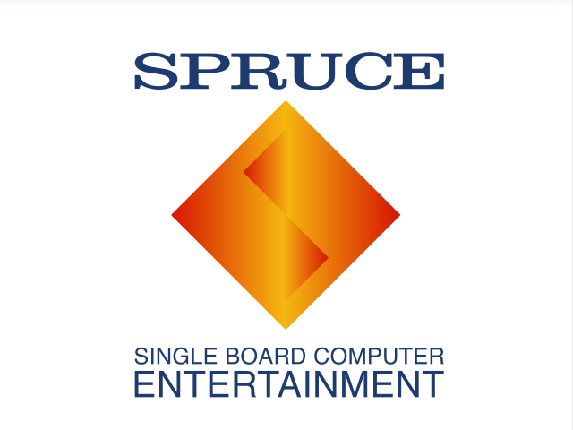
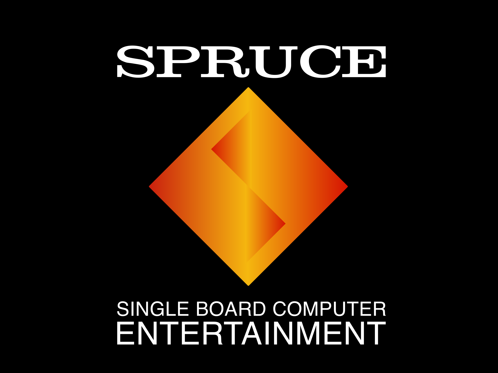

# PS-Modern

_Author_ : Nicolas C | Nico-Sylvestre  
_Licence_ : CC BY | Please credit me if you use this theme or its content as part of your work. 

    

## Description

This theme was designed with the Trimui Smart Pro S in mind. It should work on other trimUI devices and devices running SpruceOS 
Most of the icons come from [Google Font](https://fonts.google.com/icons)
Other icons were drawn by me, taking inspiration from PlayStation icons (Vita and PSP).

## Variants

### Dark-cold
This is the original color palette for this theme. Dark theme with good contrast.

    

[Download](https://github.com/nco-design/PS-modern-theme/releases/download/v1.0.0/PS-modern-dark-cold-1.0.0.zip)

### Light-grey
Same icons, but with a retro look. This palette is inspired by the classic PS1 grey.

    

**Coming soon**

### Light-white
Same icons, but brighter. Designed for white handhelds.

    

**Coming soon**

### Boot logos

     

[Download](https://github.com/nco-design/PS-modern-theme/releases/download/bootlogo/PS1-boot.zip)

## How to install
### Installing themes

Download the release as a .zip 
Unzip it on your computer, then take the folder and paste it on your SD card in the /theme folder. 

### Installing boot logos

Download the release as a .zip 
Unzip it on your computer, then take the folder and paste it on your SD card in the /App/Bootlogo/Imgs folder. 

## More information

Find more of my work on my [Github profile](https://github.com/nco-design).
